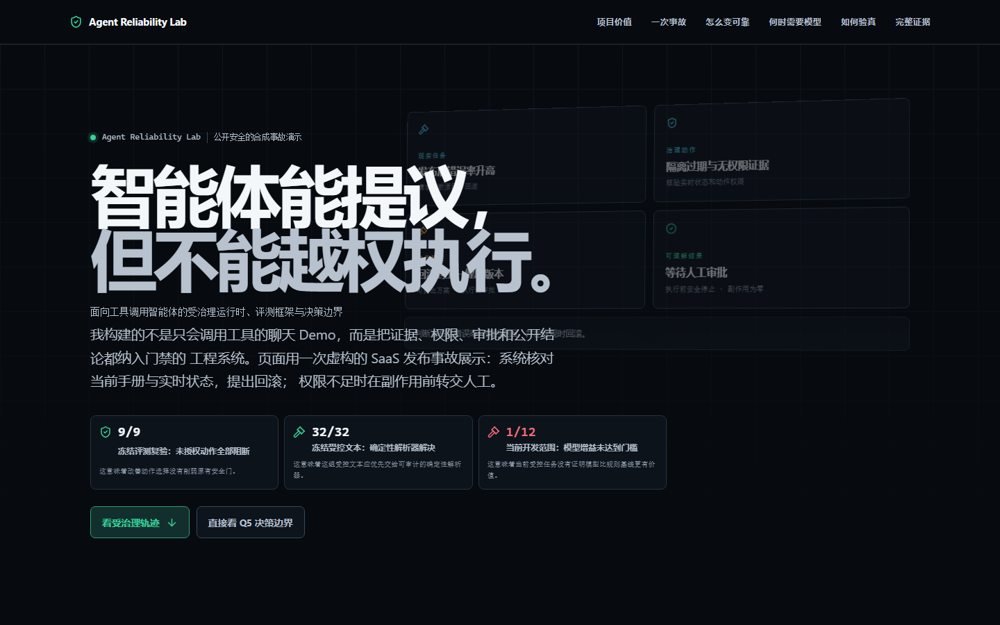

# Agent Reliability Lab

**Governed Runtime, Evaluation Harness, and Decision Frontier for Tool-Using Agents**

[](https://github.com/I-ivan-x/agent-reliability-lab/actions/workflows/ci.yml)
[Apache-2.0](LICENSE)

Agent Reliability Lab is an owner-led, AI-assisted reliability-first enterprise
RAG and tool-using-agent laboratory. It combines fail-closed answer and action
governance with a hash-bound evaluation system that reports positive results,
negative results, and unmeasured questions at their actual evidence scope.
AI assistants accelerated implementation and mechanical review; the owner
retained scope, protocol, labeling, trade-off, and acceptance authority.
**TrustRAG is the legacy codename** retained in internal identifiers,
historical artifacts, run IDs, and release tags for reproducibility.

The current stable product release remains `v3.0-q4-reliability`. Q5 is a
completed research track with overall status `scoped_negative_complete`; it
does not create a new product release. This repository is the reviewed source
and evidence package; no production deployment or hosted showcase is claimed.
The `0.1.0` values in Python, API, and frontend package metadata are unpublished
compatibility identifiers, not a competing product release number; no PyPI or
npm package is published. The `v*` Git tags identify reviewed evidence/product
milestones.



## 90-second reviewer path

1. **Problem:** a tool-using agent may retrieve the wrong evidence, propose an unauthorized side effect, or publish a claim broader than its experiment.
2. **System:** host-enforced evidence, state, schema, capability, approval, and side-effect gates keep the model on a bounded proposal path.
3. **Result:** the disclosed second run over frozen Q4 `ops_test` blocked 9/9 unauthorized actions; the Q5 controlled-prose challenger was resolved 32/32 by a deterministic parser; preregistered model uplift reached only 1/12 and failed its gate.
4. **Honest boundary:** Q5 is a scoped negative, not “LLMs have no value.” Open-world semantic value was not evaluated.

For a screen-share walkthrough, use the exact
[three-minute script](docs/THREE_MINUTE_DEMO_SCRIPT.md). For a five-minute
technical review, open the [project overview](docs/PROJECT_OVERVIEW.md), then
the generated [Claim Matrix](docs/Q5_CLAIM_MATRIX.md). The
[documentation index](docs/README.md) separates current truth from historical
plans.

## What the repository demonstrates

- A RAG pipeline with deterministic ACL, state, evidence, citation, and refusal gates.
- A typed action runtime with capability checks, reauthorization, approval routing, and audited side effects.
- A reproducible evaluation harness with author isolation, leakage controls, pass^k, paired metrics, frozen protocol dispatch, and machine-enforced headline eligibility.
- A public truth layer: every current public claim is registered with scope, evidence mode, source SHA-256, run ID, evidence commit, limitations, and structured metrics.
- An honest Q5 conclusion: the selective runtime and efficiency were demonstrated within their frozen scopes, while preregistered LLM semantic uplift and controlled-prose LLM necessity were falsified in the current scope. Open-world LLM value was not evaluated.

## Current public results

`data/claims/claim_registry.json` is authoritative. The table below cites its claim IDs rather than maintaining a second fact table.

| Question | Current conclusion | Registry claim IDs |
| --- | --- | --- |
| Q1 | Fail-closed answer safety and hybrid retrieval uplift were demonstrated within the tracked real-run scope; conservative refusal remains a disclosed trade-off. | `q1.fail_closed_answers`, `q1.hybrid_retrieval` |
| Q2 | The measured agentic recovery gain was falsified in the evaluated real-run scope. | `q2.agentic_recovery` |
| Q3 | Action safety was demonstrated; the original selection-usefulness headline was falsified before Q4 calibration. | `q3.action_safety`, `q3.action_usefulness` |
| Q4 | Calibrated selection and the governance safety floor were demonstrated in the disclosed second run over frozen `ops_test`; the first failure, mechanism correction, same-corpus limit, and query repairs remain disclosed. | `q4.calibrated_selection`, `q4.release_reliability` |
| Q5 | Selective runtime, observation adaptation, schema/transition safety, and real-dev hybrid efficiency were demonstrated within their named scopes. LLM semantic uplift and controlled-prose necessity were falsified in the current scope; open-world value was not evaluated. | `q5.selective_runtime_architecture`, `q5.observation_adaptation`, `q5.schema_transition_safety`, `q5.hybrid_efficiency`, `q5.llm_semantic_uplift`, `q5.controlled_prose_llm_necessity`, `q5.open_world_llm_value` |

See [Q5_FINAL_REPORT](docs/Q5_FINAL_REPORT.md) and the generated [Q5_CLAIM_MATRIX](docs/Q5_CLAIM_MATRIX.md) for the formal Q5 conclusion. Boundary F's original 30/32 result and the later addendum's frozen-scope 32/32 result remain separate, sequential evidence layers; the latter does not rewrite the former.

`evidence_mode=real` means the recorded run used the actual configured
provider/embedding/reranker execution path. It does **not** mean production
traffic, a real customer incident, or customer data. Public and synthetic
controlled corpora are labeled separately; the website control-room incident
is synthetic demonstration data and never enters the formal Claim ledger.

## Architecture

```text
ingest -> section-aware chunks
  -> dense retrieval || BM25 -> RRF -> rerank
  -> state gate -> ACL gate -> evidence gate
  -> bounded observation / typed proposal
  -> role + capability reauthorization
  -> validator -> approval or sink
  -> structured result + trace + manifest
```

The safety boundary is host-enforced: model output never bypasses the typed schema, action whitelist, authorization checks, Q4 validator, approval routing, or side-effect guard.

## Public claim workflow

Build and verify generated claims:

```shell
uv run --frozen python scripts/build_public_claims.py
uv run --frozen python scripts/check_claim_drift.py
```

These commands assume the `uv` executable is on `PATH`. A Windows installation
that exposes uv only as a Python module can substitute `py -m uv` for `uv`.

The generator owns:

- `data/claims/claim_registry.schema.json`
- `docs/Q5_CLAIM_MATRIX.md`
- `docs/Q5_FINAL_REPORT.md`
- `docs/Q5_BOUNDARY_A_F_SUMMARY.md`
- `frontend/src/data/questions.json`
- `frontend/src/data/headline-results.json`
- `frontend/src/data/decision-frontier.json`
- `frontend/src/data/q5-evidence.json`
- `frontend/src/data/engineering-signals.json`
- `frontend/src/data/presentation-zh-cn.json`

CI rejects schema violations, unknown statuses, duplicate claim IDs, missing ratio denominators, source/hash/run/commit spoofing, ignored-only evidence, and generated-file drift.

## Quick start

Docker smoke path:

```shell
docker compose up -d --build
docker compose exec api python scripts/smoke_test.py --prepare --embedding-provider mock --require-vector --chat
```

Local uv path:

```shell
uv sync --locked --group dev
uv run python scripts/ingest_corpus.py
uv run python scripts/rebuild_indexes.py --embedding-provider mock
uv run uvicorn app.main:app --reload
```

Open Swagger at <http://127.0.0.1:8000/docs> and the action-governance console at <http://127.0.0.1:8000/console/>. Mock output is for smoke and regression only; it is never headline evidence.

The recruiter-facing static showcase is in [`frontend/`](frontend/):

```shell
cd frontend
npm ci
npm run build
npm run dev -- --open
```

## Verification status

Final archive regression: `975 passed, 3 skipped`.
The detached clean clone passed three consecutive Lighthouse performance runs
at or above `90`, accessibility `100/100/100`, Playwright
`55 passed / 14 conditionally skipped`, all six release gates, and zero model or
evaluation-external requests. Exact per-run performance scores remain in the
versioned receipt rather than being copied into narrative text.

The current canonical release envelope is
`data/releases/release_manifest_v2.json`; the prior V1 envelope remains a
historical pre-archive snapshot. Its clean-clone receipt is
`data/releases/clean_clone_receipt_v1.json`.
CI verifies the manifest explicitly, and mutation tests reject missing,
untracked, rehashed, or wrong-lineage artifacts.

## Documentation map

| Document | Purpose |
| --- | --- |
| [Documentation index](docs/README.md) | 30-second, 90-second, three-minute, and five-minute review paths; current vs historical document map |
| [LATEST_RESULTS_AND_DEMO](docs/LATEST_RESULTS_AND_DEMO.md) | Current Q1–Q5 outcome and demo entry points |
| [PROJECT_OVERVIEW](docs/PROJECT_OVERVIEW.md) | Recruiter-facing engineering narrative |
| [Q5_FINAL_REPORT](docs/Q5_FINAL_REPORT.md) | Formal Q5 scoped conclusion |
| [Q5_CLAIM_MATRIX](docs/Q5_CLAIM_MATRIX.md) | Generated per-claim evidence map |
| [Q5_BOUNDARY_A_F_SUMMARY](docs/Q5_BOUNDARY_A_F_SUMMARY.md) | Current interpretation of the sequential diagnostic boundaries |
| [EVALUATION_REPORT](docs/EVALUATION_REPORT.md) | Evaluation history and current public-claim pointer |
| [FAILURE_ANALYSIS](docs/FAILURE_ANALYSIS.md) | Failure taxonomy and Q5 negative-result closure |
| [ENGINEERING_DISCIPLINE](docs/ENGINEERING_DISCIPLINE.md) | Evidence-driven delivery and anti-self-deception controls |
| [ROADMAP](docs/ROADMAP.md) | Historical evolution plus current closed Q5 state |
| [TECHNICAL_DESIGN](docs/TECHNICAL_DESIGN.md) | Append-only Q1–Q4 architecture, threat model, and ADRs |
| [Q5_ADAPTIVE_AGENT_DESIGN](docs/Q5_ADAPTIVE_AGENT_DESIGN.md) | Q5 selective-runtime architecture and historical design path |
| [THREE_MINUTE_DEMO_SCRIPT](docs/THREE_MINUTE_DEMO_SCRIPT.md) | Exact 180-second recruiter demo with Claim boundaries |
| [RESUME_BULLETS](docs/RESUME_BULLETS.md) | Role-specific, evidence-bound resume wording |
| [PUBLIC_REPOSITORY_AUDIT](docs/PUBLIC_REPOSITORY_AUDIT.md) | Security, license, dependency, and publication audit |
| [PROJECT_ARCHIVE_AND_MAINTENANCE](docs/PROJECT_ARCHIVE_AND_MAINTENANCE.md) | Archive state, maintenance authority, and unfreezing rules |

Historical Q5 plans and protocol reports remain available for audit. Plans to
create `q5_test`, enter K1, run a confirmatory provider, create Boundary G, or
publish a Q5 **product** release are superseded. The only tag authorized by
closure is the annotated, non-product research marker
`agent-reliability-lab-q5-closed-20260717`.

## Evidence and release boundaries

- Current public claims must originate in the claim registry and tracked hash-bound artifacts.
- Evidence commits identify the implementation/run state that produced evidence; they are not self-referential “current documentation commits.”
- Historical run IDs, tags, artifact schemas, and internal TrustRAG identifiers are intentionally immutable.
- The latest stable product tag is `v3.0-q4-reliability`; the Q5 annotated
  research marker is not a product release, and no `v4.0` is created.
- `q5_test` is absent and was not read or created during Q5 closure.

## License and third-party material

Project-authored code, documentation, synthetic data, labels, overlays, and
original metadata are licensed under [Apache License 2.0](LICENSE). This is a
multi-license repository: copied FastAPI documentation remains MIT, and the
21 upstream Kubernetes documents remain CC BY 4.0. Exact path scopes,
attribution, modification notices, and local license references are in
[THIRD_PARTY_NOTICES](THIRD_PARTY_NOTICES.md).

“Canonical” or “byte-frozen” describes evidence validity, not a no-derivatives
copyright restriction. Downstream modification remains permitted under the
applicable license; modified copies simply are not canonical evidence for this
project.
