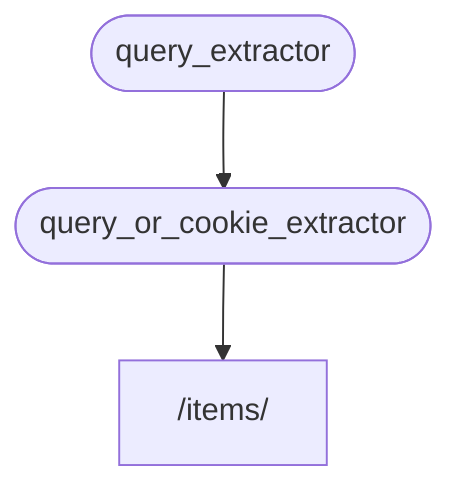

# Sub-dependencies { #sub-dependencies }

You can create dependencies that have **sub-dependencies**.

They can be as **deep** as you need them to be.

**FastAPI** will take care of solving them.

## First dependency "dependable" { #first-dependency-dependable }

You could create a first dependency ("dependable") like:

{* ../../docs_src/dependencies/tutorial005_an_py310.py hl[8:9] *}

It declares an optional query parameter `q` as a `str`, and then it just returns it.

This is quite simple (not very useful), but will help us focus on how the sub-dependencies work.

## Second dependency, "dependable" and "dependant" { #second-dependency-dependable-and-dependant }

Then you can create another dependency function (a "dependable") that at the same time declares a dependency of its own (so it is a "dependant" too):

{* ../../docs_src/dependencies/tutorial005_an_py310.py hl[13] *}

Let's focus on the parameters declared:

* Even though this function is a dependency ("dependable") itself, it also declares another dependency (it "depends" on something else).
    * It depends on the `query_extractor`, and assigns the value returned by it to the parameter `q`.
* It also declares an optional `last_query` cookie, as a `str`.
    * If the user didn't provide any query `q`, we use the last query used, which we saved to a cookie before.

## Use the dependency { #use-the-dependency }

Then we can use the dependency with:

{* ../../docs_src/dependencies/tutorial005_an_py310.py hl[23] *}

/// note

Notice that we are only declaring one dependency in the *path operation function*, the `query_or_cookie_extractor`.

But **FastAPI** will know that it has to solve `query_extractor` first, to pass the results of that to `query_or_cookie_extractor` while calling it.

///



## Using the same dependency multiple times { #using-the-same-dependency-multiple-times }

If one of your dependencies is declared multiple times for the same *path operation*, for example, multiple dependencies have a common sub-dependency, **FastAPI** will know to call that sub-dependency only once per request.

And it will save the returned value in a <dfn title="A utility/system to store computed/generated values, to reuse them instead of computing them again.">"cache"</dfn> and pass it to all the "dependants" that need it in that specific request, instead of calling the dependency multiple times for the same request.

In an advanced scenario where you know you need the dependency to be called at every step (possibly multiple times) in the same request instead of using the "cached" value, you can set the parameter `use_cache=False` when using `Depends`:

//// tab | Python 3.10+

```Python hl_lines="1"
async def needy_dependency(fresh_value: Annotated[str, Depends(get_value, use_cache=False)]):
    return {"fresh_value": fresh_value}
```

////

//// tab | Python 3.10+ non-Annotated

/// tip

Prefer to use the `Annotated` version if possible.

///

```Python hl_lines="1"
async def needy_dependency(fresh_value: str = Depends(get_value, use_cache=False)):
    return {"fresh_value": fresh_value}
```

////

## Recap { #recap }

Apart from all the fancy words used here, the **Dependency Injection** system is quite simple.

Just functions that look the same as the *path operation functions*.

But still, it is very powerful, and allows you to declare arbitrarily deeply nested dependency "graphs" (trees).

/// tip

All this might not seem as useful with these simple examples.

But you will see how useful it is in the chapters about **security**.

And you will also see the amounts of code it will save you.

///
